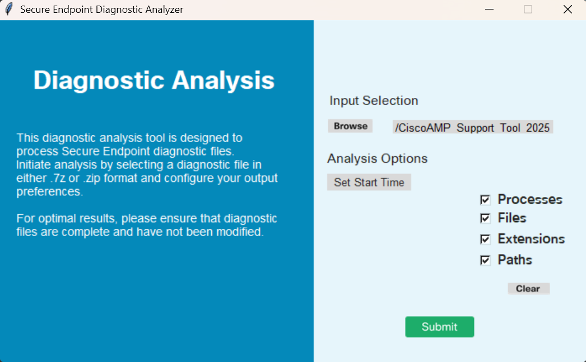

### Secure Endpoint Windows Tuning Tool:

Windows Endpoint tuning tool provides a quick view of top file and process scans occurring on a connector, designed to assist with performance tuning.

### Before using you must have the following:

Debug diagnostic file from the host in question

### Usage:

1. Launch the Secure Endpoint Tuning Tool executable.
2. Click Browse to select the debug diagnostic file you want to analyze.
3. Configure the analysis options as needed.
4. Click "Submit" to start the analysis.

Diag_Analyzer.exe will check the provided Secure Endpoint diagnostic file for sfc.exe.log files.
It will then create a results directory with the diagnostic file name and store the log files outside of the .7z, in the parent directory of the diagnostic.
Next, it will parse the logs and determine the Top 10 Processes, Files, Extensions and top 100 Paths.
Finally, it will print that information to the screen and also to a summary.txt file.

### Screenshot

